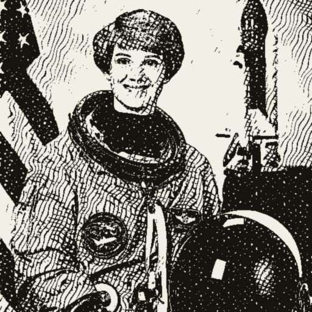

# Hermes Mythic Design

A design skill + image tool that reproduces the **Hermes Agent / Nous Research
"engraved parchment"** aesthetic — *Renaissance print shop meets terminal*.
Cream paper backgrounds, warm-ink serif type, monospace instrument details,
hairline rules, and **classical-engraving figures generated from any photo**.



It does two things:

1. **A design system** — the exact colors, typography, components, and texture
   rules of the look, in [`SKILL.md`](SKILL.md) and
   [`references/design-tokens.md`](references/design-tokens.md).
2. **An engraving generator** — [`scripts/engrave.py`](scripts/engrave.py) turns
   **any image** (portrait, statue, ship, product…) into a vintage
   copperplate-style etching on parchment — ideal for the **faded hero/section
   background images** this look is known for.

---

## The background-image engraver

This is the part that makes the look: take a normal photo or painting and render
it as ink linework that fades into the paper, so headline text stays readable on
top. It powers every background image on the example site below.

```bash
pip install pillow numpy

# closest match to the Hermes mythic figures (crosshatch engraving):
python scripts/engrave.py photo.jpg engraving.png --style hatch

# ready-to-use hero/section BACKGROUND, pre-faded toward the paper colour:
python scripts/engrave.py photo.jpg hero-bg.png --background --fade-direction left

# other looks:
python scripts/engrave.py photo.jpg out.png --style contour   # banknote / currency lines
python scripts/engrave.py photo.jpg out.png --style stipple   # dotted etching
```

**Key options**

| Flag | What it does |
| --- | --- |
| `--style hatch \| contour \| stipple` | engraving technique (hatch = default, the Hermes figure look) |
| `--background` | adds a directional fade to paper so the image works *behind text* |
| `--fade-direction left\|right\|top\|bottom` | pick the side opposite your text |
| `--period 5–10` | line spacing — lower = finer (6–7 for faces, 9–10 for large backgrounds) |
| `--contrast` | raise (~1.6) for flat/hazy photos |
| `--gamma` | tone curve before hatching — `0.5–0.8` lifts shadows on **dark/night photos** so they stop blocking up into solid ink; `1.2–1.6` deepens a washed-out image |

> The `--gamma` shadow-lift is an addition to the original skill: dark source
> images used to turn into solid black blobs; gamma fixes that more cleanly than
> just dropping contrast.

Public-domain statue/painting photos (Met Open Access, Wikimedia Commons) make
great source material, but the engraver makes almost anything fit the system.

---

## The design system (quick reference)

Full spec in [`references/design-tokens.md`](references/design-tokens.md). The
non-negotiables:

- Background is parchment `#f2efe6`, text is warm ink `#16140f` — **never** pure
  white or pure black.
- **Serif** for display (EB Garamond / Cormorant), **mono** for commands and
  labels (IBM Plex Mono). Uppercase letter-spaced mono eyebrows with `•`
  separators are the signature detail.
- Square corners, **hairline 1px rules** instead of shadows (a `4px 4px 0` rule
  offset for a letterpress feel is the only allowed shadow).
- One accent colour max — burnt sienna `#b0501f` — used sparingly.
- Engraving backgrounds always **fade into the paper** so text sits on clean
  parchment, plus a subtle SVG paper-grain overlay at ≤4% opacity.

See [`examples/hermes-style-demo.html`](examples/hermes-style-demo.html) for a
self-contained page using all of it.

---

## Using it as a Claude skill

`hermes-mythic-design.skill` is the packaged, installable bundle. Drop the
unpacked folder (this repo's `SKILL.md` + `references/` + `scripts/`) into your
agent's skills directory (e.g. `~/.claude/skills/hermes-mythic-design/`), or load
the `.skill` package directly. The agent reads `SKILL.md`, which tells it to
consult the design tokens before writing any CSS/HTML and to run `engrave.py`
when a mythic background is wanted.

---

## Built with it: The Viking Company

This skill was used to design and build **[The Viking Company](https://github.com/NylasDev/the-viking-company)**,
an AI-engineer portfolio.

**How that site is built — the framework:**

- **Next.js 15** (App Router), **statically exported** (`output: "export"`) — the
  same framework and deployment model as the real Hermes Agent site. No server
  needed; it deploys as static files.
- **TypeScript**, with the sections as small React components.
- **Fonts:** EB Garamond (display serif) + IBM Plex Mono (mono), self-hosted via
  `next/font`.
- **Styling:** hand-written CSS using the design tokens above — no UI framework.
- **Imagery:** public-domain Viking longship paintings run through
  `engrave.py --background` to produce the faded ink-on-parchment hero and
  section backgrounds.

---

## License

MIT — see [`LICENSE`](LICENSE). The example public-domain source artworks belong
to their respective public-domain collections.
